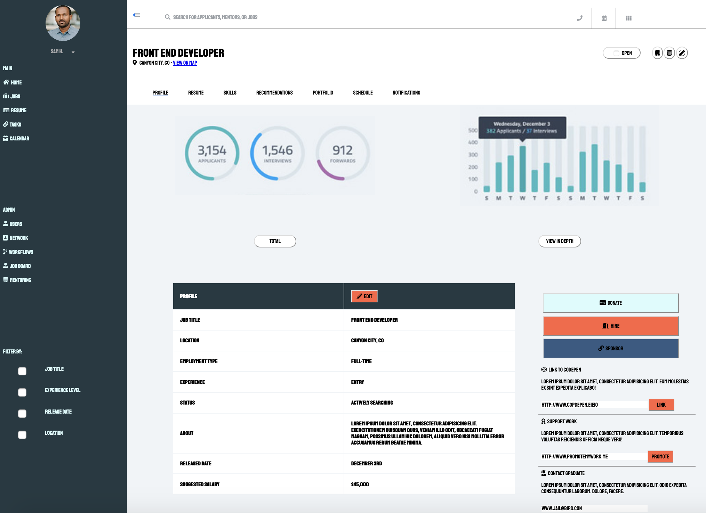

<h1>Static Comp Two</h1>

For this project I was tasked with created a comp of the mock websoite - see image below. The static comp content could be changed as well as the colors, but the basci structure had to be the same. This comp is adequate, however it is far from perfect for three reasons. 1. Time managment was lacking. 2. There are no media queries. 3. The main images are screenshots and not created in the comp and are not dynamic.

